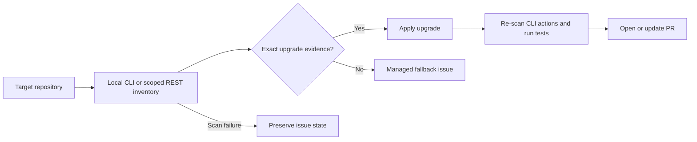

# snyk-auto-remediate

[](https://github.com/uppnrise/snyk-auto-remediate/actions/workflows/ci.yml)
[](LICENSE)
[](https://github.com/uppnrise/snyk-auto-remediate/releases/tag/v1.0.0-rc.1)

Automated, evidence-based dependency remediation for GitHub repositories.

The project combines a reusable GitHub Actions workflow with a TypeScript engine. It scans the
checked-out repository with the Snyk CLI by default, applies only exact upgrade paths reported
by Snyk, re-scans CLI-evidenced changes, runs detected or configured tests, and opens or updates
one remediation pull request per target branch and report ID. Explicitly scoped REST inventory
is also supported; its exact remedies are applied without a CLI verification scan.

Findings without a safe exact upgrade are represented by managed GitHub Issues. Those issues are
updated while a finding remains active and closed when it no longer requires fallback work.

**Release candidate:** validate on a disposable repository before production use. See the
[roadmap](ROADMAP.md), [changelog](CHANGELOG.md), and [security policy](SECURITY.md).
Package-manager detection and implemented commands do not imply live validation of every ecosystem.



## Quick start

Prerequisites: a Snyk token stored as `SNYK_TOKEN`, Actions enabled on the target repository,
and permission for Actions to create PRs. Review GitHub's
[workflow permissions setting](https://docs.github.com/en/repositories/managing-your-repositorys-settings-and-features/enabling-features-for-your-repository/managing-github-actions-settings-for-a-repository).
Scoped REST inventory additionally needs a Snyk organization ID and REST issue access.

Create a workflow in the repository you want to remediate:

```yaml
name: Snyk remediation

on:
  workflow_dispatch:
  schedule:
    - cron: '0 3 * * 1'

permissions:
  contents: write
  pull-requests: write
  issues: write
  security-events: write

jobs:
  remediate:
    uses: uppnrise/snyk-auto-remediate/.github/workflows/snyk-remediate.reusable.yml@v1.0.0-rc.1
    with:
      engine-ref: v1.0.0-rc.1
      target-branches: main
      severity-threshold: high
      dry-run: true
    secrets:
      SNYK_TOKEN: ${{ secrets.SNYK_TOKEN }}
```

Start with `dry-run: true`, inspect the workflow summary and artifacts, then disable dry-run when
the result matches the repository. Set `SNYK_ORG_ID` as a GitHub Actions variable only when using
explicit `snyk-project-ids`.

Pin the reusable workflow reference and `engine-ref` to the same reviewed tag or commit SHA.
The example uses the first release candidate; stable promotion is tracked in the roadmap.
The Snyk CLI itself follows the floating `stable` channel.

## Inventory and project scoping

Safety is repository-first:

- Without `snyk-project-ids`, the engine uses repository-local Snyk CLI findings. It does not
  import the entire organization's issue inventory into one GitHub repository.
- With `snyk-project-ids`, the engine fetches those exact Snyk REST projects and skips initial
  local scans. An unambiguous exact REST remedy can produce an action when one local ecosystem
  is detected. The configured projects must belong to this repository and project directory.
- REST-evidenced upgrades are not marked as CLI-verified fixes and remain in SARIF. Multiple
  local ecosystems or ambiguous remedies become fallback work.
- When CLI/REST correlation is available, project identity must match. CLI results without a
  project identity require exactly one configured Snyk project.
- Findings verified as fixed are excluded from the SARIF uploaded for that run.

If scoped REST access returns `403`, the engine safely falls back to repository-local CLI
inventory.
The report records the actual inventory source. A CLI fallback keeps local findings actionable
and reportable without filtering them against REST project UUIDs. CLI and REST issue scopes are
separate, so a fallback run cannot close issues created from REST inventory.

## Remediation flow

For each target branch and report ID, the engine:

1. Detects one JavaScript package manager and any additional top-level ecosystems.
2. Prepares package managers that need local dependencies or Corepack.
3. Runs authenticated Snyk CLI scans in local-inventory mode.
4. Loads local inventory, or explicitly scoped REST inventory.
5. Correlates CLI evidence or resolves exact scoped REST remedies.
6. Builds only unambiguous, exact upgrade actions.
7. Applies changes with the native package manager.
8. Re-scans CLI-evidenced actions and rolls back an ecosystem batch if verification fails.
9. Commits applied changes to a stable remediation branch.
10. Runs every detected ecosystem's test suite, or one explicit custom command.
11. Pushes and creates or updates the remediation PR.
12. Reconciles fallback issues within the same scope after a complete, error-free run.
13. Writes JSON, SARIF, and GitHub Actions summary reports.

## Supported package managers

| Manager | Detection | Exact remediation |
| --- | --- | --- |
| npm | `package-lock.json` or `package.json` | `npm install --save-exact` |
| Yarn | `yarn.lock` | `yarn add --exact` |
| pnpm | `pnpm-lock.yaml` | `pnpm add --save-exact` |
| pip | `requirements.txt` | pins a direct requirement, then installs it |
| Poetry | `poetry.lock` | `poetry add` |
| Maven | `pom.xml` | `versions:use-dep-version` |
| Gradle | `build.gradle`, `build.gradle.kts` | edits literal dependency coordinates |
| Go modules | `go.mod` | `go get`, then `go mod tidy` |
| Composer | `composer.json` or `composer.lock` | `composer require` |

Detection is intentionally top-level. For a monorepo, invoke the reusable workflow once per
project directory with a unique `report-id`.
See the [two-project example](docs/examples/monorepo-workflow.yml).

Yarn and pnpm take precedence over the generic `package.json` npm signature. A standalone
`pyproject.toml` is not assumed to be Poetry; `poetry.lock` is required.

## Important inputs

| Input | Default | Purpose |
| --- | --- | --- |
| `target-repository` | caller repository | Repository in `owner/repo` form |
| `target-branches` | `master` | Comma-separated branches |
| `engine-ref` | `master` | Engine tag, branch, or SHA |
| `report-id` | `scan` | Isolates branches, artifacts, and SARIF categories |
| `working-directory` | `.` | Project directory inside the target repository |
| `snyk-project-ids` | unset | Exact REST project scope; unset uses local CLI inventory |
| `severity-threshold` | `high` | `critical`, `high`, `medium`, or `low` |
| `package-managers` | auto-detect | Explicit manager allow-list |
| `dry-run` | `false` | Reports planned work without mutating GitHub or git |
| `max-issues-per-run` | `10` | Limits fallback issue creates/updates |
| `run-tests` | `true` | Runs detected test suites before push |
| `test-command` | unset | Shell command replacing automatic test selection |
| `enable-copilot-agent-fallback` | `true` | Manages fallback GitHub Issues |

For a different private target repository, provide `GH_PAT`. The caller's `github.token` normally
suffices when the caller and target are the same repository.
For SARIF upload, the token must also have code-scanning write access to the target repository
([GitHub SARIF API permissions](https://docs.github.com/en/rest/code-scanning/code-scanning#upload-an-analysis-as-sarif-data)).

## Operational behavior

- Remediation branches are stable:
  `chore/security/snyk-remediation-{target-branch}-{report-id}-{hash}`. The hash uses the original
  branch and report ID, preventing punctuation or truncated names from sharing a branch.
- Repeated runs reset that automation-owned branch from the requested target branch and update the
  existing PR.
- Workflow concurrency serializes runs for the same repository, branch, and report ID.
- Fallback issue scope includes the repository-relative directory, target branch, report ID,
  actual inventory source, organization/project selection, severity threshold, and package-manager selection.
- SARIF is uploaded to the scanned repository, branch, and commit. After a published fix, results
  belong to the remediation branch; target-branch alerts remain until that branch is scanned again.
  Uploads wait for GitHub processing and fail if validation fails or processing times out.
- Failed or partial scans, unsupported project directories, failed tests, and push/PR errors
  preserve existing fallback issues. A failed engine step does not replace code-scanning results
  with partial SARIF; JSON/SARIF artifacts remain available for diagnosis.
- Old issues without the new scope marker are left untouched. Review and close or migrate them
  manually after a successful scoped run; new scoped issues may coexist during that transition.
- Changing scope inputs creates a new issue-management scope. Review issues in the old scope
  manually. Keep report IDs stable and unique per project invocation.
- Pushes use `--force-with-lease`.
- Older remediation branches and PRs are retained when moving to hashed branch names. Review and
  close them manually after the replacement PR is ready. Scope version 2 similarly leaves older
  fallback issues untouched. These changes are listed under Unreleased in the changelog; the
  `v1.0.0-rc.1` tag retains its original behavior.
- Custom labels are created when missing.
- If the configured Copilot assignee is unavailable, the fallback issue is created unassigned
  instead of failing the entire run. Assigning issues to Copilot requires the relevant GitHub
  Copilot plan and repository settings.
- Raw Snyk data in an issue is bounded to prevent GitHub body-size failures.
- Dry-run performs scans/preparation and writes reports, but does not commit, push, or mutate
  GitHub issues/PRs/labels, including workflow failure alerts. Dependency preparation may install
  packages locally; use a disposable checkout.

## Example output

Reports distinguish planned work from applied changes and CLI-verified fixes. This illustrative
dry-run summary is not a live scan:

| Metric | Count |
| --- | --- |
| Total findings | 3 |
| Exact-action findings | 2 |
| Verified fixed findings | 0 |
| Fallback issues planned | 1 |
| PRs created | 0 |

See the [full Actions summary](docs/examples/run-summary.md),
[JSON report](docs/examples/remediation-report.json), and
[remediation PR example](docs/examples/remediation-pr.md).

## Limits and troubleshooting

- Top-level dependency manifests only; invoke separately per monorepo project. Containers, IaC,
  Snyk Code, automatic PR merging, and guessed upgrade versions are outside scope.
- Complex Gradle expressions, indirect pip requirements, and ambiguous upgrade paths may need
  manual work. `fixedIn` alone is not treated as an exact upgrade instruction.
- Missing `SNYK_TOKEN` or failed CLI authentication: inspect the failed step and token access.
  Scope issue reconciliation is skipped; an empty report is not proof the repository is clean.
- Scoped REST `403`: local CLI fallback is attempted. Other REST errors fail the run.
- No detected ecosystem: check `working-directory`, manifests, and `package-managers` filtering.
- PR permission errors: check the Actions PR setting, token permissions, and target repository.
  PR checks may require approval when using `GITHUB_TOKEN`; see GitHub's current
  [workflow-triggering rules](https://docs.github.com/en/actions/how-tos/write-workflows/choose-when-workflows-run/trigger-a-workflow).
- Missing tests: provide `test-command` when automatic detection does not select the right suite.
  `run-tests: true` does not guarantee a test command exists for every target.
- Snyk installation failure: check the CI smoke test and CDN availability. `stable` prevents
  stale exact pins but does not guarantee JSON schema compatibility.
- Copilot assignment unavailable: the finding issue is created unassigned; this does not mean a
  coding agent has started work.

For a reproducible bug, use the [bug report form](https://github.com/uppnrise/snyk-auto-remediate/issues/new/choose).
For vulnerabilities in the toolkit, use [private reporting](SECURITY.md).

## Development

The executable package is under [`scripts/remediate`](scripts/remediate):

```bash
cd scripts/remediate
npm ci
npm test -- --run
npm run build
npm run lint
npm run format:check
npm audit --audit-level=moderate
```

See [`scripts/remediate/README.md`](scripts/remediate/README.md) for local execution details.
Coverage includes orchestration and is published as a CI artifact.
See [contributing](CONTRIBUTING.md), [code of conduct](CODE_OF_CONDUCT.md), and
[release guidance](docs/RELEASING.md).
